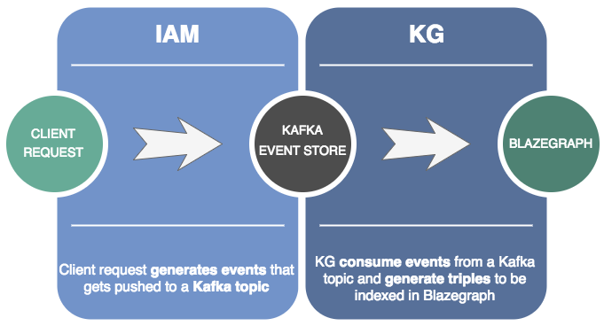

# Securing queries

Security is enforced through ACLs. An ACL describes the restriction on a specific `resource` with some `permissions` for a particular `identity`.

Securing queries requires two steps:

1. Defining an indexing strategy for ACLs
2. Make use of the indexing strategy to perform a query which will filter out the resources which are not readable for a particular identity.

## Indexing ACLs


ACL `Events` being generated by customer requests in `IAM`. Those events are being streamed to a Kafka topic.
On the `KG` side, there is a consumer listening to the same Kafka topic. Every incoming event will (if required) generate or remove certain triples in Blazegraph.

### PermissionsCreated event

It signals that some permissions have been created for an identity(s) on a resource.

In this example, the path `/kg/organization/domain/schema` is converted into the resource paths `https://nexus.example.com/v0/schemas/organization/domain/schema` and `https://nexus.example.com/v0/contexts/organization/domain/schema`
and only the identity `Anonymous` will be stored as a triple, because it is the only one containing `read` permissions.

Event
:   @@snip [permissions_created.json](../assets/api-reference/acls/index/permissions_created.json)

Indexed triples
:   @@snip [permissions_created_triples.txt](../assets/api-reference/acls/index/permissions_created_triples.txt)

### PermissionsAdded event

It signals that some permissions have been added for an identity on a resource.


In this example, the path `/kg` represents the root path of all resources in the system. This means that the identity of type `GroupRef` with realm `realm` and group name `a-group` should have access to any search on the platform.
This is signaled by the property `nxv:hasPermissions` and the value `nxv:readAll`

Event
:   @@snip [permissions_added.json](../assets/api-reference/acls/index/permissions_added.json)

Indexed triples
:   @@snip [permissions_added_triples.txt](../assets/api-reference/acls/index/permissions_added_triples.txt)

### PermissionsSubtracted event

It signals that some permissions have been subtracted from an identity on a resource.


In this example, the path `/kg/organization/domain/schema/v1.0.0/uuid` is converted into the resource path `https://nexus.example.com/v0/data/organization/domain/schema/v1.0.0/uuid`.
The identity of type `UserRef` with realm `realm` and subject `alice` is going to loose the access on the resource path `https://nexus.example.com/v0/data/organization/domain/schema/v1.0.0/uuid`. 

Event
:   @@snip [permissions_subtracted.json](../assets/api-reference/acls/index/permissions_subtracted.json)

Un-indexed triples
:   @@snip [permissions_subtracted_triples.txt](../assets/api-reference/acls/index/permissions_subtracted_triples.txt)

### PermissionsCleared event

It signals that all permissions associated to a resource have been removed for every identity.


In this example, the path `/kg/organization/domain/schema/v1.0.0` is converted into the resource paths `https://nexus.example.com/v0/schemas/organization/domain/schema/v1.0.0` and `https://nexus.example.com/v0/contexts/organization/domain/schema/v1.0.0`.
Every triple on those resources is removed (we clear the graph where those triples belong). 

Event
:   @@snip [permissions_cleared.json](../assets/api-reference/acls/index/permissions_cleared.json)

### PermissionsRemoved event

It signals that all permissions associated to a resource have been removed from an identity.


In this example, the path `/kg/organization` is converted into the resource path `https://nexus.example.com/v0/organizations/organization`.
The identity of type `Anonymous` is going to loose the access on the resource path `https://nexus.example.com/v0/organizations/organization`. 

Event
:   @@snip [permissions_removed.json](../assets/api-reference/acls/index/permissions_removed.json)

Un-indexed triples
:   @@snip [permissions_removed_triples.txt](../assets/api-reference/acls/index/permissions_removed_triples.txt)


## Queries with ACL information

Once the triples are indexed on Blazegraph, we can make use of them at query time to constrain the response with the identities we perform the queries.

In other words, we have to verify that a list of `Identity` have `read` permissions on the resources we want to return from the query.

Imagine we come to the query with the following identities:

```json
[
{
    "@id": "https://nexus-iam.example.com/v0/realms/realm/groups/a-group",
    "realm": "realm",
    "group": "a-group",
    "@type": "GroupRef"
  },
  {
    "@id": "https://nexus-iam.example.com/v0/anonymous",
    "@type": "Anonymous"
  }
]
```

In the following tabs it is explained how our query will look like, depending on which resource is being targeted:

Organization
:   @@snip [organization.txt](../assets/api-reference/acls/query/organization.txt)

Domain
:   @@snip [domain.txt](../assets/api-reference/acls/query/domain.txt)

SchemaName
:   @@snip [schemaname.txt](../assets/api-reference/acls/query/schemaname.txt)

Schema
:   @@snip [schema.txt](../assets/api-reference/acls/query/schema.txt)

ContextName
:   @@snip [schemaname.txt](../assets/api-reference/acls/query/schemaname.txt)

Context
:   @@snip [schema.txt](../assets/api-reference/acls/query/context.txt)

Instance
:   @@snip [instance.txt](../assets/api-reference/acls/query/instance.txt)
